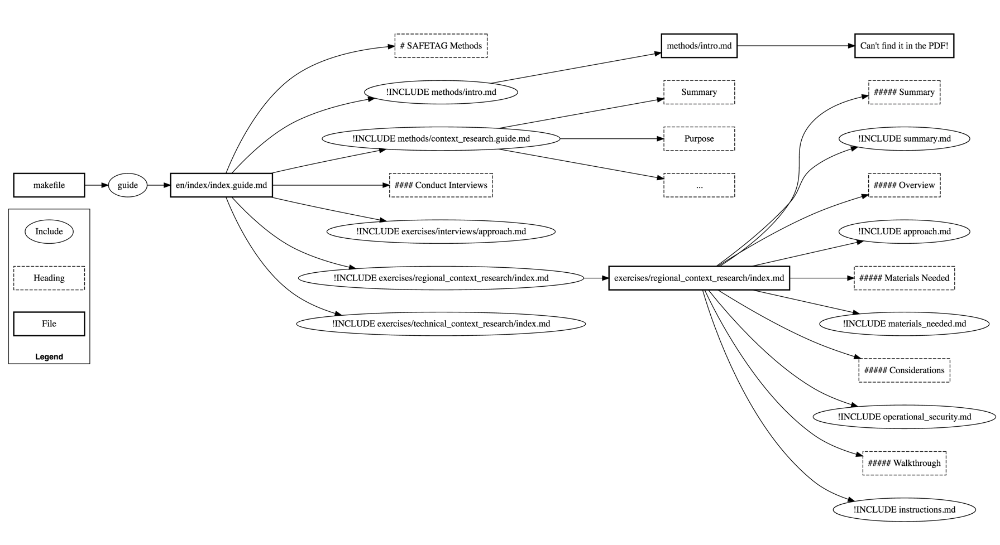

# Include structure




```plantuml
digraph openintegrityschema {
  rankdir=LR;
 ratio="0.5";
# size="12,12"
 clusterMode="global";
 edge [fontsize="10.0" labeldistance="20" labelangle="30"];
	node [shape = "circle"];
 Include, "guide", "!INCLUDE methods/intro.md","!INCLUDE methods/context_research.guide.md", "!INCLUDE exercises/interviews/approach.md", "!INCLUDE exercises/regional_context_research/index.md", "!INCLUDE exercises/technical_context_research/index.md", "!INCLUDE summary.md", "!INCLUDE approach.md", "!INCLUDE materials_needed.md", "!INCLUDE operational_security.md", "!INCLUDE instructions.md" [shape = "oval"];
 node [shape = "box" width="1.5" style="bold"];
 Heading, "# SAFETAG Methods", Summary, Purpose, "...", "#### Conduct Interviews", "##### Summary", "##### Overview", "##### Materials Needed", "##### Considerations", "##### Walkthrough" [shape = "rect" width="1.5" style = "dashed" fontcolor="black"];
# Schema, Feature, Project, Instance, Configuration, Package, Issue, AuditDocument [shape = "box" width="1.5" style="bold"];

subgraph main {
  edge [fontsize="10.0" labeldistance="20" labelangle="30"];

  makefile -> guide
  guide -> "en/index/index.guide.md"
  "en/index/index.guide.md" -> "# SAFETAG Methods"
  "en/index/index.guide.md" -> "!INCLUDE methods/intro.md"
  "!INCLUDE methods/intro.md" -> "methods/intro.md"
  "methods/intro.md" -> "Can't find it in the PDF!"
  "en/index/index.guide.md" -> "!INCLUDE methods/context_research.guide.md"
  "!INCLUDE methods/context_research.guide.md" -> Summary
  "!INCLUDE methods/context_research.guide.md" -> Purpose
  "!INCLUDE methods/context_research.guide.md" -> "..."
  "en/index/index.guide.md" -> "#### Conduct Interviews"

  "en/index/index.guide.md" -> "!INCLUDE exercises/interviews/approach.md"
  "en/index/index.guide.md" -> "!INCLUDE exercises/technical_context_research/index.md"
  "en/index/index.guide.md" -> "!INCLUDE exercises/regional_context_research/index.md"

  "!INCLUDE exercises/regional_context_research/index.md" -> "exercises/regional_context_research/index.md"

  "exercises/regional_context_research/index.md" -> "##### Summary"
  "exercises/regional_context_research/index.md" -> "!INCLUDE summary.md"

  "exercises/regional_context_research/index.md" -> "##### Overview"
  "exercises/regional_context_research/index.md" -> "!INCLUDE approach.md"

  "exercises/regional_context_research/index.md" -> "##### Materials Needed"
  "exercises/regional_context_research/index.md" -> "!INCLUDE materials_needed.md"

  "exercises/regional_context_research/index.md" -> "##### Considerations"
  "exercises/regional_context_research/index.md" -> "!INCLUDE operational_security.md"

  "exercises/regional_context_research/index.md" -> "##### Walkthrough"
  "exercises/regional_context_research/index.md" -> "!INCLUDE instructions.md"

}


{ rank = same;
"##### Summary" -> "!INCLUDE summary.md" -> "##### Overview" -> "!INCLUDE approach.md" -> "##### Materials Needed" -> "!INCLUDE materials_needed.md" -> "##### Considerations" -> "!INCLUDE operational_security.md" -> "##### Walkthrough" -> "!INCLUDE instructions.md"
[style = invis];
}

 { rank = same;
 "# SAFETAG Methods" -> "!INCLUDE methods/intro.md" -> "!INCLUDE methods/context_research.guide.md" -> "#### Conduct Interviews" -> "!INCLUDE exercises/interviews/approach.md" -> "!INCLUDE exercises/regional_context_research/index.md" -> "!INCLUDE exercises/technical_context_research/index.md"
 [style = invis];
 }


graph [labelloc="b" fontsize="12.0" fontname="helvetica-bold"];


 subgraph cluster_1 {
   label="Exercises";
   edge [color="invis"];
  "!INCLUDE exercises/interviews/approach.md";
  "!INCLUDE exercises/regional_context_research/index.md";
  "!INCLUDE exercises/technical_context_research/index.md";
 }

 subgraph cluster_4 {
   label="Legend";
   edge [color="invis"];
   File;
   Heading;
   Include;
 }

}
```
